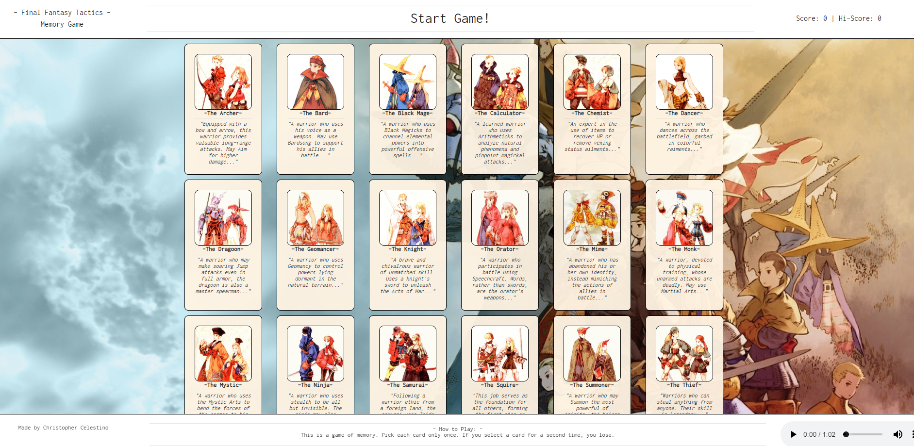

# Final Fantasy Tactics Memory Game `(Clicky-Game)`

Link to [Deployed App](https://BAANG.github.io/Clicky-Game)



---

## Description

`Final Fantasy Tactics Memory Game` aka `Clicky Game` is a single-page application built with React and deployed on a Node environment.

This application is a simple memory game in which the user must select cards without repeating themselves. At the same time, once a user selects a card, the order in which the cards are rendered is shuffled.

---

## Code Explanation

```js
// The interactive elements and game logic is dynamically generated and updated and managed by updating the 'state' within React, forcing the application to re-render the DOM every time the App.state is updated.

class App extends Component {

  state = {
    characters: characters,
    userPicks: [],
    hiScore: 0,
    message: "Start Game!",
  }
```

```js
// handleUserPicks is the onClick function that is made a property on all of the dynamically generated character cards. It obtains the 'name' value of each of the card and prompts the application to then verify whether the user picked a unique card succesfully, or insuccesfully. Regardless of the success, clicking on a card will force the array to shuffle, update the state, and re-render the cards in the new re-shuffled order.

handleUserPicks = event => {
    const name = event.target.getAttribute('name');
    console.log('Name:', event.target.getAttribute('name'))
    this.checkPick(name, this.setScore)
    this.shuffleCards()
  }

```

```js
// Handles the shuffling of the characters array.

shuffleArray = (array) => {
    let j;
    let temp;
    let i;
    for (i = array.length - 1; i > 0; i--) {
      j = Math.floor(Math.random() * (i + 1));
      temp = array[i];
      array[i] = array[j];
      array[j] = temp;
    }
    return array;
}

shuffleCards = () => {
    this.setState(this.setState.characters = this.shuffleArray(this.state.characters))
}
```

```js
// In the checkPick function, when updating the state. I update all of the new values into a variable 'newState' so that when mutating 'this.state' all of the new values will be changed at the same time, keeping the DOM from re-rendering multiple times for a user action.

 checkPick = (name, callback) => {
    const newState = { ...this.state };
    if (newState.userPicks.includes(name)) { // On insuccesful guess...
      newState.message = `You've already guessed The ${name}! Too bad.`;
      newState.userPicks = [];
      this.setState(newState);
    } else { // On succesful guess...
      newState.userPicks.push(name);
      newState.message = `You've picked The ${name}! Good job!`;
      this.setState(newState)
      console.log(this.state)
    }
    callback(newState, this.message)
  }
```

---

## Technologies Used

| Technologies Used |  |
| :---: | :--- |
| HTML5 | |
|
| CSS3 | |
|
| JavaScript | |
|
| ReactJS | https://github.com/facebook/react |
|
| Node.js |  https://nodejs.org/ |
| Node Package Manager `(NPM)` | https://npmjs.com/
|
| Git | https://git-scm.com/ |
| GitHub | https://github.com/

---

<sub>

Created by [Christopher Celestino](https://BAANG.github.io/)
for the UC Berkeley Extension, Full Stack Coding Bootcamp.

This project was bootstrapped with [Create React App](https://github.com/facebook/create-react-app).

</sub>
